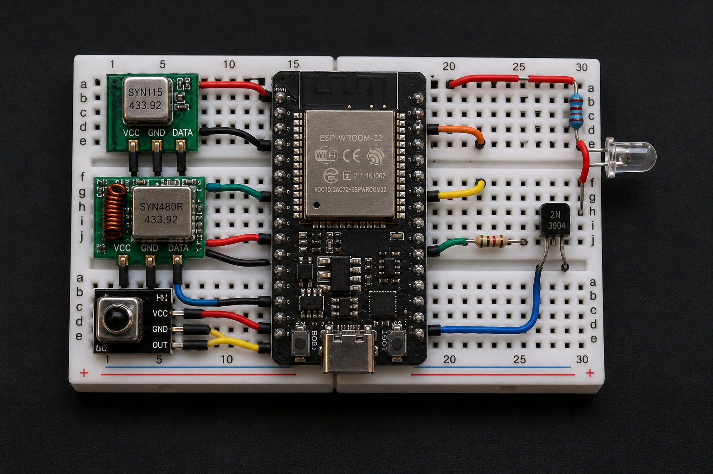
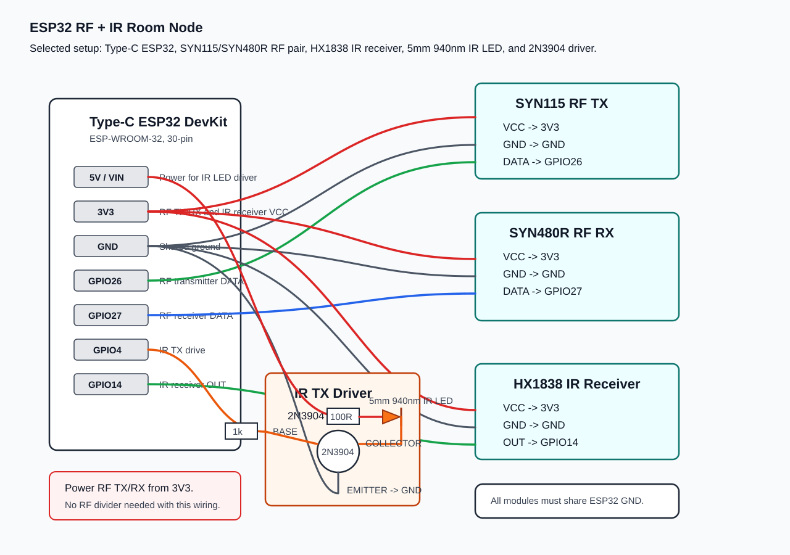

# Arduino Remote Controller

Local smart-home controller for RF fans and IR air conditioners.

Flow:

```text
phone/browser -> laptop web app -> HTTP over Wi-Fi -> ESP32 room node -> RF/IR -> appliance
```

## What is included

- FastAPI backend served from the always-on laptop.
- SQLite database for nodes, learned signals, timers, workflows, schedules, and event counts.
- Browser dashboard for phones/laptops on the same Wi-Fi.
- ESP32 starter firmware for 433 MHz RF send/capture and raw IR send/capture.

This starter uses HTTP between the laptop and ESP32 nodes. MQTT can be added later if you want broker/pub-sub behavior, but it is not required for a single local controller.

## Hardware ingredients

Buy one set per room node.

Selected hardware list:

| Ingredient | Shopee link | Confirmed item / variation | Use in this project | Status |
| --- | --- | --- | --- | --- |
| ESP32 DevKit | [ESP32 30 Pin ESP-WROOM-32 Wi-Fi Bluetooth Development Board](https://my.shp.ee/RNU8PSQR) | Type-C ESP32-WROOM-32, 30-pin; CH340C, CP2102, or CH9102 USB chip is OK | Main room node controller. Runs Wi-Fi, HTTP API, RF send/capture, and IR send/capture firmware. | Received |
| 433 MHz RF transmitter + receiver | [SYN115/SYN480R 433MHz transmitter receiver pair](https://shopee.com.my/1Set-2Pcs-433MHZ-Wireless-Transmitter-Receiver-Board-Module-SYN115-SYN480R-ASK-OOK-Chip-PCB-for-arduino-i.72422724.21780766516) | SYN115 transmitter + SYN480R receiver, 433MHz | RF TX sends Fanzo/RF fan commands. RF RX captures/learns the original remote signal. | Pending |
| NPN transistor | [Transistor 2N Series](https://my.shp.ee/Lde77knv) | 2N3904; do not use PNP parts such as 2N3906 or 2N2907 | Drives the IR LED with more current than ESP32 GPIO can safely supply. Needed for stronger AC IR transmit range. | Received |
| IR receiver + small IR transmitter module | [HX1838 Infrared IR Receiver Sensor And LED Transmitter Module](https://my.shp.ee/7tuaENzw) | HX1838 receiver + LED transmitter module | IR receiver learns/captures AC remote signals. Small transmitter module can be used for short-range testing. | Received |
| IR emitter LED pack | [10pcs F3mm F5mm LED Infrared Emitting Diode](https://my.shp.ee/e6HjUNmi) | 5 mm IR emitter 940 nm; choose emitter, not receiver/photodiode/phototransistor | Final AC IR transmitter LED. Connect through 100 ohm resistor and 2N3904 transistor driver. | Pending |
| 1k resistor | [10pcs/pk Resistor 1/4W 1ohm to 1m ohm](https://shopee.com.my/10pcs-pk-Resistor-1-4W-1ohm-10ohm-100ohm-1k-ohm-10k-ohm-100k-ohm-1m-ohm-10m-ohm-5-Fixed-Resistor-i.20221256.7267802426) | 1k | ESP32 GPIO4 to 2N3904 base. | Pending |
| 100 ohm resistor | [10pcs/pk Resistor 1/4W 1ohm to 1m ohm](https://shopee.com.my/10pcs-pk-Resistor-1-4W-1ohm-10ohm-100ohm-1k-ohm-10k-ohm-100k-ohm-1m-ohm-10m-ohm-5-Fixed-Resistor-i.20221256.7267802426) | 100 ohm | IR LED current limit. | Received |
| Jumper wires | [Male to Male 40pcs Dupont Jumper Wire](https://shopee.com.my/Male-to-Male-%28MM%29-40pcs-Dupont-Jumper-Wire-DIY-Experiment-Breadboard-Rainbow-40p-Wires-Cable-10cm-20cm-30cm-for-Arduino-i.1389163043.48700856188) | Male-to-male, 10cm, 40pcs | Breadboard wiring between ESP32, RF modules, IR receiver, and IR driver. This setup uses 14 male-to-male jumpers minimum. | Pending |
| Breadboard | [Mini 400 Points Solderless Prototype Breadboard](https://shopee.com.my/Mini-400-Points-Solderless-Prototype-Breadboard-for-Experiments-Projects-Papan-Tampa-Pematerian--i.53171392.3741813404) | 400 holes | Mounts ESP32, RF TX/RX, IR receiver, IR LED, transistor, and resistors with no loose modules. Compact build; cramped but workable. | Received |

If you use a ready-made IR transmitter module, connect its signal pin to GPIO4, VCC to 3.3V first, and GND to GND. For reliable 2m or longer AC control, use the 5 mm 940 nm IR LED plus transistor circuit below.

## Breadboard and jumper plan

Use a 400-hole MB102 breadboard for the compact build. It is enough for the ESP32 and all modules mounted on the same breadboard with no loose modules, but the layout will be cramped. Use an 830-hole breadboard only if you want easier debugging and more space between parts.

Assumption: ESP32 and modules have male header pins and plug directly into the breadboard. If any module has no header pins, solder male header pins to it first.

Minimum jumper count:

| Jumper type | Minimum count | Recommended purchase | Purpose |
| --- | --- | --- | --- |
| Male-to-male | 14 | 40pcs pack, 10cm | All breadboard wiring. |
| Male-to-female | 0 | Not needed | Only needed if a module is not plugged into the breadboard. |
| Female-to-female | 0 | Not needed | Only needed for direct module-to-module pin wiring without breadboard. |

Male-to-male count breakdown:

| Wiring group | Count |
| --- | --- |
| ESP32 3V3 to breadboard 3V3 rail | 1 |
| ESP32 GND to breadboard GND rail | 1 |
| ESP32 5V/VIN to breadboard 5V rail for IR LED driver | 1 |
| SYN115 VCC/GND to rails | 2 |
| SYN115 DATA to GPIO26 | 1 |
| SYN480R VCC/GND to rails | 2 |
| SYN480R DATA to GPIO27 | 1 |
| HX1838 VCC/GND to rails | 2 |
| HX1838 OUT to GPIO14 | 1 |
| GPIO4 to 1k resistor / 2N3904 base node | 1 |
| 2N3904 emitter to GND rail | 1 |

The 1k resistor, 100 ohm resistor, 2N3904, and 5 mm IR LED plug directly into breadboard holes, so they do not need female jumper wires.

Final compact breadboard layout reference:



Use the image for physical placement. Use the connection summary below for exact GPIO wiring.

## Circuit diagram



Connection summary:

| Part | Pin | Connect to |
| --- | --- | --- |
| SYN115 RF transmitter | DATA | ESP32 GPIO26 |
| SYN115 RF transmitter | VCC | ESP32 3V3 |
| SYN115 RF transmitter | GND | ESP32 GND |
| SYN480R RF receiver | DATA | ESP32 GPIO27 |
| SYN480R RF receiver | VCC | ESP32 3V3 |
| SYN480R RF receiver | GND | ESP32 GND |
| IR receiver | OUT/SIGNAL | ESP32 GPIO14 |
| IR receiver | VCC | ESP32 3V3 |
| IR receiver | GND | ESP32 GND |
| IR LED driver | ESP32 GPIO4 | 1k resistor to 2N3904 base |
| IR LED driver | 2N3904 emitter | ESP32 GND |
| IR LED driver | 2N3904 collector | IR LED short leg |
| IR LED driver | IR LED long leg | 100 ohm resistor to ESP32 5V/VIN |

Important: keep the SYN115 transmitter and SYN480R receiver powered from ESP32 3V3. Do not power the RF receiver from 5V when DATA is connected directly to GPIO27.

## Laptop setup

```bash
cd backend
python3 -m venv .venv
source .venv/bin/activate
pip install -r requirements.txt
uvicorn app.main:app --host 0.0.0.0 --port 8000
```

Open from the laptop:

```text
http://127.0.0.1:8000
```

Open from a phone on the same Wi-Fi:

```text
http://<laptop-lan-ip>:8000
```

Find the laptop LAN IP on macOS:

```bash
ipconfig getifaddr en0
```

The SQLite file is created at `backend/smart_home.sqlite3`. Override with:

```bash
SMART_HOME_DB=/path/to/controller.sqlite3 uvicorn app.main:app --host 0.0.0.0 --port 8000
```

Default schedule timezone is `Asia/Kuala_Lumpur`. Override with:

```bash
APP_TIMEZONE=Asia/Kuala_Lumpur uvicorn app.main:app --host 0.0.0.0 --port 8000
```

## Timers and workflows

Single timer:

```text
after 30 minutes -> press Fan Off
```

Workflow:

```text
after 30 minutes -> press Fan Speed 1
after 1 hour -> press Fan Off
```

Immediate next action:

```text
after 30 minutes -> press Fan Speed 1
0 minutes -> press Fan Off
```

Workflow step delays are relative. The next delay starts after the previous action succeeds. If one step fails, later steps are cancelled.
Saved workflows can be edited from the dashboard. Edits affect future runs, not runs already created.

Workflow schedule:

```text
daily at 22:30 -> start Night routine
Mon, Tue, Wed, Thu, Fri at 07:00 -> start Morning routine
```

If the first workflow step is `0 minutes`, the first action runs at the scheduled time.
The dashboard shows active jobs in one list: pending timers, enabled schedules, enabled workflow schedules, and pending/running workflow runs.

## Learn signals

Add the ESP32 room node, then use `Learn signal`.

```text
name: Bedroom fan power
node: Bedroom ESP32
signal: RF 433MHz
```

When capture succeeds, the learned signal is saved as a dashboard button automatically. Name the signal with the device/action you want to recognise later, such as `Bedroom AC Cool 24` or `Living fan speed 2`.

## ESP32 setup

Arduino IDE:

- Board package: ESP32 by Espressif
- Board: ESP32 Dev Module
- Libraries:
  - `rc-switch`
  - `IRremoteESP8266`

Firmware:

```text
firmware/esp32_room_node/esp32_room_node.ino
```

First boot Wi-Fi setup:

1. Upload the firmware.
2. Connect a phone/laptop to the `rf-ir-node-setup` Wi-Fi network.
3. Open `http://192.168.4.1`.
4. Save home Wi-Fi SSID, password, and node name.
5. The ESP32 reboots onto your home Wi-Fi.

Hold the ESP32 `BOOT` button during startup to clear saved Wi-Fi settings.

Starter pins:

| Function | GPIO |
| --- | --- |
| RF TX | 26 |
| RF RX | 27 |
| IR TX | 4 |
| IR RX | 14 |

After Wi-Fi setup, open Serial Monitor and copy the ESP32 IP. Add that IP as a node in the dashboard, for example:

```text
http://192.168.1.42
```

## ESP32 HTTP API

Health:

```http
GET /health
```

Send RF:

```http
GET /send/rf?code=123456&bits=24&protocol=1&pulse_length=350&repeat=6
```

Send raw IR:

```http
POST /send/ir/raw?khz=38&repeat=1
Content-Type: text/plain

9000,4500,560,560,560,1690
```

Capture RF:

```http
GET /capture/rf?timeout_ms=8000
```

Capture IR:

```http
GET /capture/ir?timeout_ms=10000
```

## Signal notes

- Fanzo MINI remote is probably RF, but confirm by capture. If no RF capture appears, check frequency and antenna length.
- Cheap RF modules work best with fixed-code 433 MHz remotes. Rolling-code remotes will not clone cleanly.
- AC remotes usually send full-state IR frames. Capture each complete AC state you care about, such as `Cool 24 Fan Auto`.
- App state can drift when someone uses the original physical remote.

## Network notes

This is local-first software. Run it only on trusted home Wi-Fi. Do not expose the laptop port to the internet.
